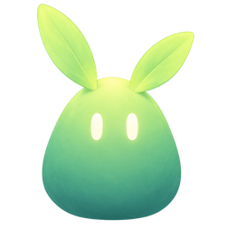
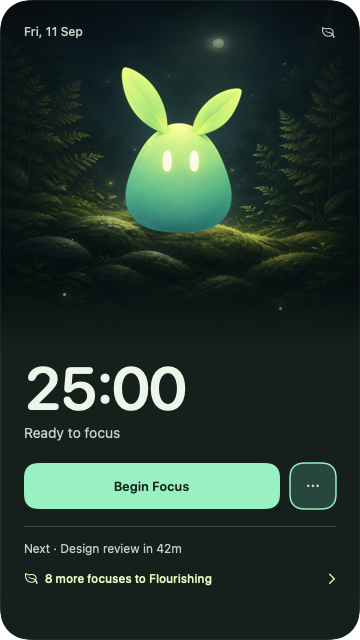
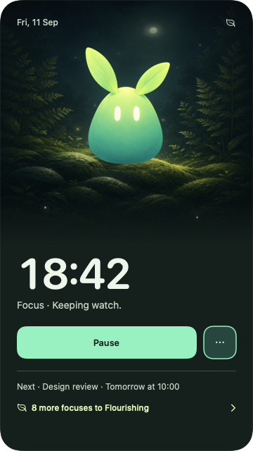
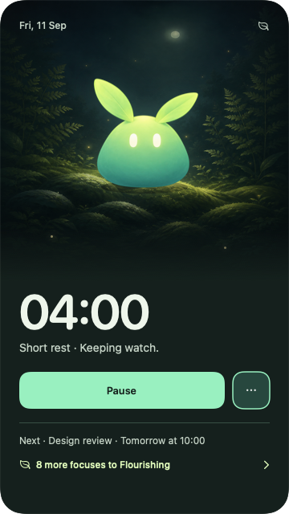

<div align="center">



# Tepal

**A native Mac companion for focus sessions and calendar reminders.**

Tepal lives in your Dock with a forest habitat one click away. It keeps time,
remembers your focus sessions, and reminds you about meetings.
Everything stays on your Mac.

[](#try-it-from-source)
[](#try-it-from-source)
[](Package.swift)
[](Package.swift)
[](docs/BETA.md)
[](LICENSE)

Created by **[Or Balog](https://www.linkedin.com/in/or-balog/)**

</div>

<div align="center">

| Ready | Focusing | Resting |
|:--:|:--:|:--:|
|  |  |  |

<sub>App-rendered test scenes. Meeting details shown here are fictional.</sub>

</div>

## What it does

**Focus until your next meeting.** Start a session that ends two minutes before
the meeting, leaving time to get ready.

**Check what's next with two taps.** Optional double-knock sensing brings up your
next event on compatible Macs. It is off by default.

**Keep what you've finished.** Completed focus sessions grow your companion and
unlock palettes. Pausing or closing the app preserves timer recovery.

## Try it from source

> [!NOTE]
> This is an early source release. The packaged app is ad-hoc signed;
> a notarized download is not available yet.

Requires an **Apple silicon Mac on macOS 26+** with **Swift 6.2+** and matching
Xcode or Command Line Tools.

```bash
git clone https://github.com/Or-Balog/Tepal.git
cd Tepal
Scripts/test.sh
Scripts/package-app.sh release
open dist/Tepal.app
```

[Build and installation details →](docs/DEVELOPMENT.md)

## Your calendar, on your Mac

Tepal has no account, backend, analytics or network client. For reminders,
connect a Google account through macOS Internet Accounts, then choose your
calendars in Tepal. The timer works without this connection.

> [!IMPORTANT]
> macOS asks for Full Calendar Access, but Tepal only reads events. Event titles
> stay in memory. The optional motion sensor uses an undocumented hardware
> interface, so the app runs without App Sandbox.

[Privacy details →](docs/PRIVACY.md)

## Made by Or Balog

I built Tepal because I kept running into two problems at work: getting
distracted when I wanted to focus, and missing calendar popups when I finally
did. Sometimes that meant showing up late to a meeting.

I wanted a focus timer and meeting reminders in one small companion. Tepal is my
attempt at that.

— **[Or Balog](https://www.linkedin.com/in/or-balog/)**

Built in Swift with AppKit and SwiftUI, with no third-party Swift package
dependencies.

The name comes from *tepal*, a leaf-like part of a flower. It fits the creature's
leafy shape, with a small "pal" at the end.

## Contributing

Bug reports and focused contributions are welcome. `TepalCore` holds the timer,
reminder and creature policies; `TepalMac` owns macOS integration, persistence
and motion sensing; `TepalApp` owns the UI and app lifecycle.

<div align="center">

**[Contributing](CONTRIBUTING.md)** · **[Beta status](docs/BETA.md)** · **[Development](docs/DEVELOPMENT.md)** · **[Privacy](docs/PRIVACY.md)** · **[Credits](CREDITS.md)**

<sub>

[MIT License](LICENSE) · Copyright © 2026 **Or Balog**

</sub>

</div>
